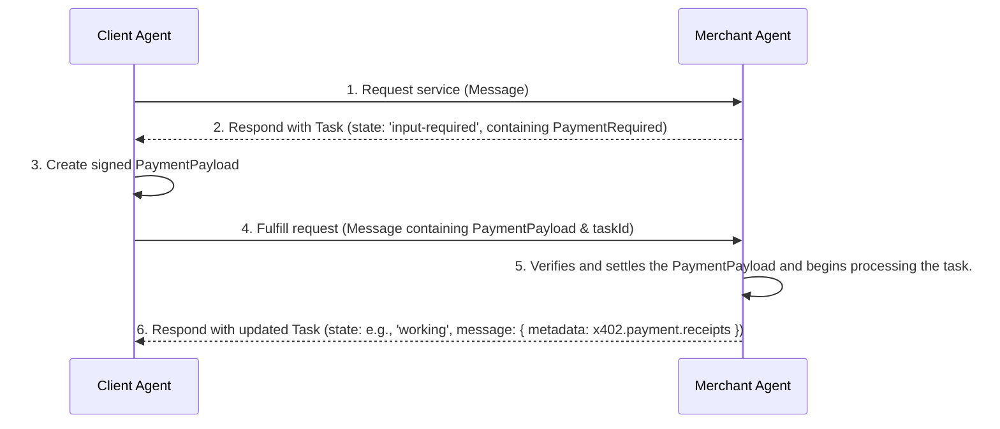
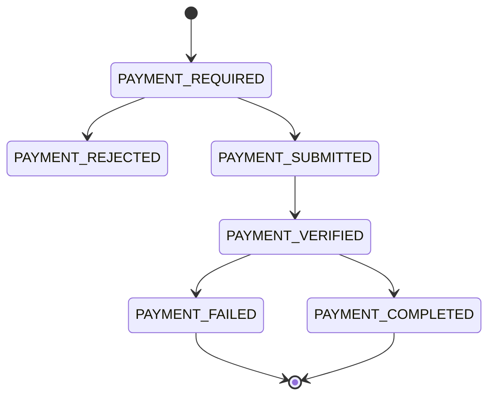

# A2A Protocol: x402 Payments Extension v0.3

## 1. Abstract

The x402 Payments Extension is an **Extension** for the Agent-to-Agent (A2A) protocol. It enables agents to monetize services through on-chain cryptocurrency payments, reviving the spirit of the HTTP 402 "Payment Required" status code for the world of decentralized agents.

This is the **v0.3** revision of the extension. Its defining change from v0.2 is that it becomes a **thin profile on top of the x402 Foundation A2A transport**. The wire envelopes, metadata keys, payment status lifecycle, task-state mapping, and error handling are defined normatively by the foundation transport specification ([`x402-transport-a2a-v2.md`](./x402-transport-a2a-v2.md), the vendored V2 revision of [`x402-transport-a2a-v1.md`](./x402-transport-a2a-v1.md)). This document does not re-specify that transport prose; it references it, and adds only the contributions that are unique to this extension:

1. The **composable design** — the Standalone and Embedded (AP2) flows.
2. The three **signing models** for the Embedded flow — Atomic, Delegated, and Smart Contract Escrow.
3. A **transition and negotiation** profile that lets v0.2 (x402 V1) and v0.3 (x402 V2) agents interoperate during a migration window (see [Section 9](#9-transition-and-negotiation)).

### 1.1. Relationship to x402 protocol generations

The extension tracks two generations of the underlying x402 protocol:

| This extension | x402 protocol | Activation URI | Wire envelopes |
|---|---|---|---|
| v0.2 | V1 (`x402Version: 1`) | `https://github.com/google-agentic-commerce/a2a-x402/blob/main/spec/v0.2` | V1 (`maxAmountRequired`, bare network names, flat `resource`) |
| **v0.3** (this document) | **V2 (`x402Version: 2`)** | `https://github.com/google-a2a/a2a-x402/v0.1` | V2 (`amount`, CAIP-2 networks, top-level `resource` object, echoed `accepted`) |

The five `x402.payment.*` metadata keys, the payment status values, the task-state mapping, `taskId` correlation, and the EIP-3009 signing typed-data are **identical across both generations**. Only the requirements/payload JSON envelopes differ. See the measured deltas in [Section 6](#6-data-structures).

## 2. Extension URI

The canonical URI for this version of the extension is the x402 Foundation A2A transport URI:

```
https://github.com/google-a2a/a2a-x402/v0.1
```

Implementations of **v0.3** MUST use this URI for declaration and activation. Activation with this URI selects the **V2** wire envelopes.

For backward compatibility during the transition window, an implementation MAY additionally support the v0.2 URI (`https://github.com/google-agentic-commerce/a2a-x402/blob/main/spec/v0.2`), which selects the **V1** wire envelopes. See [Section 9](#9-transition-and-negotiation).

## 3. Extension Declaration

Agents that support this extension MUST declare it in the `extensions` array of their `AgentCard`.

```json
{
  "capabilities": {
    "extensions": [
      {
        "uri": "https://github.com/google-a2a/a2a-x402/v0.1",
        "description": "Supports payments using the x402 protocol for on-chain settlement.",
        "required": true
      }
    ]
  }
}
```

An agent that supports both generations during the transition window declares **both** URIs (see [Section 9.1](#91-dual-advertisement)).

### 3.1. Required Extension

Setting `required: true` is recommended. This signals to clients that they **MUST** understand and implement the x402 protocol to interact with the agent's monetized skills. If a required extension is not activated by the client, the agent SHOULD reject the request — subject to the family-activation rule in [Section 9.2](#92-family-activation) when both generation URIs are advertised.

## 4. Composable Design: Standalone vs. Embedded Flows

This extension is designed for composability and supports two distinct flows. Agents supporting this extension SHOULD be prepared to handle either flow.

* **Standalone Flow:** The simplest flow, used for direct monetization without a higher-level payments protocol.
  * The `PaymentRequired` object is transported in the `task.status.message.metadata` under `x402.payment.required`.
  * The `PaymentPayload` object is transported in the `message.metadata` under `x402.payment.payload`.
* **Embedded Flow (Composable):** Used when x402 acts as a Form of Payment (FOP) for a higher-level protocol such as [AP2](https://ap2-protocol.org). The Agent Card presents both the x402 extension AND the other payment framework extension (e.g. the [Agent Payment Protocol](https://ap2-protocol.org)).
  * The `PaymentRequired` object is **embedded** inside a higher-level object (e.g., an AP2 `CartMandate`) located in the `task.artifacts` array.
  * The `PaymentPayload` object is **embedded** inside a higher-level object (e.g., an AP2 `PaymentMandate`) located in the `message.parts` array.

> **Status note.** The Embedded (AP2) flow and its signing models are carried forward from v0.2 and are **provisional** in v0.3, pending convergence with the upstream "AP2-compatible x402 extension" from the google-agentic-commerce line. The Standalone flow is the stable, fully-specified path for v0.3.

### 4.1. Embedded Flow and Signing Models

A key consideration in the **Embedded Flow** is the interaction between the x402 payment payload and the higher-level commerce protocol it is embedded within. This section clarifies how to handle payload signing without introducing user friction.

**The Core Interaction.** Many commerce protocols are designed for "pull" payment methods (e.g., credit cards), where a user-signed mandate authorizes a merchant to *pull* funds using a token. The x402 protocol, however, functions as a "push" payment method, where the `PaymentPayload` *is* the signed cryptographic authorization to *push* on-chain funds.

In the embedded flow, an **order authorization** (which authorizes the *specific purchase*, e.g. an AP2 `PaymentMandate`) envelops the `PaymentPayload` (which authorizes the *payment*). While this may require two distinct signatures (one for the payment, one for the order), it does not need to result in two separate approval prompts for the user.

This specification supports three primary patterns to manage this, ensuring a seamless user experience.

#### 1. Atomic Signing (Human-Present Flow)

This is the recommended pattern for direct, human-present transactions from a user's primary wallet. The Client Agent and wallet abstract the complexity of the two signatures into a single user action.

1. **Construction:** The Client Agent assembles the *unsigned* order authorization and the *unsigned* `PaymentPayload`.
2. **Single User Approval:** The Client Agent passes both objects to a compatible wallet or signing service. The wallet's UI presents a **single, unified confirmation** to the user (e.g., "Approve payment of 120.00 USDC for 'Nike Air Max'").
3. **Atomic Signature:** Upon a single user approval, the wallet or signing service performs two signatures in the background:
   * First, it signs the `PaymentPayload`.
   * Second, it embeds the newly signed `PaymentPayload` into the data field of the order authorization.
   * Finally, it signs the complete order authorization.

The Merchant Agent then receives the order authorization containing the `PaymentPayload`, both of which are verifiably signed with a single user action.

#### 2. Delegated Signing (Human-Not-Present Flow)

This pattern is ideal for asynchronous agentic commerce and aligns with concepts like delegated authority.

1. **Pre-Authorization:** At an earlier time, the user signs a pre-authorization object. This signature grants the **Client Agent** delegated authority to execute transactions on the user's behalf within specific constraints (e.g., "buy these shoes if the price drops below $100").
2. **Agent-Handled Execution:** When the purchase conditions are met, the Client Agent acts as a pre-authorized delegate. It uses its *own* key (or a delegated key) to generate and sign both the `PaymentPayload` and the accompanying order authorization.

In this flow, the user is not present at the time of payment, and the signing is handled entirely by the trusted, pre-authorized agent, resulting in zero user friction at checkout.

#### 3. Smart Contract Escrow (Decoupled Flow)

This pattern models a "pull" payment flow and is ideal for users who pre-fund a dedicated contract. It completely separates the on-chain payment action from the at-checkout signing action.

1. **Setup (One-time Action):** The user moves funds into a smart contract (e.g., a "paymaster" contract, an escrow, or a smart contract wallet). This on-chain transaction is the *only* on-chain "push" the user performs.
2. **Checkout (Single Off-Chain Signature):** At the time of purchase, the Client Agent constructs *only* the **order authorization**. The user signs this single, off-chain message. There is no `PaymentPayload` signature from the user's primary wallet.
3. **Settlement (Merchant Initiated):** The Merchant Agent receives the user-signed order authorization.
4. **Verification & Release:** The Merchant Agent presents this signed order to the smart contract, which is programmed to:
   * Verify the user's signature on the order authorization.
   * Confirm the order details match its rules.
   * If valid, *release* the pre-deposited funds directly to the merchant.

In this flow, the smart contract itself acts as the trusted "Payer." The `PaymentPayload` embedded in the order would simply contain the contract's address and the data (like the signed order) that the merchant needs to call its "release funds" function. This mirrors a credential-based flow, as the user's signed order acts as the "credential" to unlock the payment.

### 4.2. Flow Detection Logic

A Client Agent must be able to distinguish between the Standalone and Embedded flows. The detection logic is triggered upon receiving a `Task` where the `task.status.message.metadata` contains `x402.payment.status: "payment-required"`.

The agent MUST follow this decision path:

1. Inspect the `task.status.message.metadata`.
2. **Check for Standalone Flow:** Does the `metadata` **also** contain the `x402.payment.required` key?
   * **Yes:** This is a **Standalone Flow**. The agent MUST retrieve the `PaymentRequired` object from the `metadata`'s `x402.payment.required` key.
   * **No:** This is an **Embedded Flow**.
3. **Process Embedded Flow:** The agent MUST scan the `task.artifacts` array to find a supported higher-level artifact (e.g., an AP2 `CartMandate`) and extract the embedded `PaymentRequired` object from within it.

## 5. Payment Protocol Flow

This extension represents the payment lifecycle using the high-level A2A Task state (e.g., `input-required`, `completed`) and a granular `x402.payment.status` field. The flow involves a Client Agent (acting on behalf of a user) that orchestrates interactions with a Merchant Agent (selling a service).

The **wire-level mechanics** of each step — the exact JSON-RPC messages, task states, metadata fields, and envelope shapes — are defined normatively by the foundation transport ([`x402-transport-a2a-v2.md`](./x402-transport-a2a-v2.md)):

* *Payment Required Signaling* → Step 1 (Merchant → Client).
* *Payment Payload Transmission* → Steps 2–3 (Client → Wallet → Merchant).
* *Settlement Response Delivery* → the final Task update (Merchant → Client).

The remainder of this section specifies only the **roles** and the **architecture** that this extension layers on top of that transport.

### 5.1. Roles & Responsibilities

The x402 payment protocol defines the interactions between four distinct architectural roles. While a single application might combine some of these functions (e.g., a Client Agent with an integrated Signing Service), understanding their logical separation is key to a secure and correct implementation.

#### Client Agent

The Client Agent acts on behalf of a user, orchestrating the payment flow.

* Initiates service requests to the Merchant Agent.
* Receives a `Task` that requires payment and processes the `PaymentRequired` object from its specified location (either `metadata` or an embedded object).
  * The agent first extracts the list of accepted `PaymentRequirements` from the response.
  * It then determines whether to proceed with payment based on the terms (e.g., cost, asset, network).
    * If accepting, the agent selects a preferred `PaymentRequirements` option and has it signed by a designated signing service or wallet, producing the `PaymentPayload`.
    * If rejecting, the agent responds to the Merchant Agent with `x402.payment.status: "payment-rejected"`.
* Submits the signed `PaymentPayload` back to the Merchant Agent in its specified location (e.g. in the Task metadata or an embedded AP2 `PaymentMandate`).
* Waits for and processes the final `Task`.

#### Merchant Agent

The Merchant Agent is a specialist agent that provides a monetized skill or service.

* Determines when a service request requires payment and responds with an `input-required` `Task` containing the `PaymentRequired` object (either in `metadata` or embedded).
* Receives the correlated payment submission.
* Communicates with a facilitator to first verify the payment's signature and validity, and then to settle the transaction on-chain.
* Concludes the flow by returning a final `Task` with the `x402.payment.receipts`.

**State management.** The Merchant Agent is responsible for state management, using the `taskId` to track the payment lifecycle. When it receives a payment submission, it uses the `taskId` to retrieve the original `PaymentRequirements` offered for that task — and the **generation** it offered them under (see [Section 9.3](#93-emission-and-offering-generation)) — so it can validate that the signed `PaymentPayload` corresponds to a valid payment option it previously sent.

### 5.2. Architecture

This diagram illustrates the generic A2A message exchange. The location of the x402 objects depends on the flow (Standalone vs. Embedded).



## 6. Data Structures

This extension uses the data structures defined by the x402 Foundation A2A transport ([`x402-transport-a2a-v2.md`](./x402-transport-a2a-v2.md)) and the core x402 V2 specification. The A2A extension remains a lightweight layer, focusing only on the protocol interactions, while the core x402 specification remains the single source of truth for the data models.

The primary data structures are:

* **`PaymentRequired`** — sent by the Merchant Agent to request a payment. Carries a top-level `resource` object and an `accepts[]` array.
* **`PaymentRequirements`** — describes a single accepted payment option.
* **`PaymentPayload`** — contains the client's signed payment authorization, echoing the chosen requirement under `accepted`.
* **`SettleResponse`** — returned by the Merchant Agent after settlement; used for the `x402.payment.receipts` field.

### 6.1. V1 → V2 envelope deltas

For implementers migrating from v0.2 (V1), the wire differences are:

| Item | v0.2 (V1) | v0.3 (V2) |
|---|---|---|
| `x402Version` | `1` | `2` |
| Amount field | `maxAmountRequired` | `amount` |
| Network id | bare name (e.g. `"base-sepolia"`) | CAIP-2 (e.g. `"eip155:84532"`) |
| `resource` / `description` / `mimeType` | inline in each `accepts[]` entry | hoisted to a top-level `resource` object |
| `PaymentPayload` shape | `{ x402Version, scheme, network, payload }` | `{ x402Version, resource?, accepted, payload }` |

The inner `payload` (EIP-3009 `{ signature, authorization{ from, to, value, validAfter, validBefore, nonce } }`) is **unchanged** — the signing typed-data is identical across generations.

## 7. Metadata and State Management

This extension uses the `metadata` field on `Message` objects to track the payment state. The location of the data objects depends on the flow (Standalone vs. Embedded).

* `x402.payment.status`: **(Required)** The current stage of the payment flow. This key MUST be present in all x402-related messages. Values: `"payment-required"`, `"payment-submitted"`, `"payment-rejected"`, `"payment-verified"`, `"payment-completed"`, `"payment-failed"`.
* `x402.payment.required`: The **default metadata key** for the `PaymentRequired` object. Used *only* in the Standalone Flow. It MUST NOT be used if an Embedded Flow is active.
* `x402.payment.payload`: The **default metadata key** for the `PaymentPayload` object. Used *only* in the Standalone Flow. It MUST NOT be used if an Embedded Flow is active.
* `x402.payment.receipts`: **(Required)** A persistent array containing the complete history of all `SettleResponse` objects for the task. This key MUST be present in the final task message.
* `x402.payment.error`: In case of failure, a short error code.

These keys and their semantics are **identical across v0.2 and v0.3**; only the shape of the objects stored under `x402.payment.required` and `x402.payment.payload` differs by generation.

### 7.1. State Transitions



## 8. Extension Activation

Clients MUST request activation of this extension by including its URI in the `X-A2A-Extensions` HTTP header:

```http
X-A2A-Extensions: https://github.com/google-a2a/a2a-x402/v0.1
```

The activated URI selects the generation (see [Section 9](#9-transition-and-negotiation)). A client that activates the v0.3 URI is signalling that it can process **V2** envelopes.

## 9. Transition and Negotiation

v0.2 (x402 V1) and v0.3 (x402 V2) implementations mutually reject each other at the payload validation step. To give deployed agents a migration window, this section defines how an agent that supports both generations negotiates a common one per interaction. Generation selection is carried entirely by the existing A2A extension-activation mechanism; no new metadata key or wire field is introduced.

### 9.1. Dual advertisement

A Merchant Agent that supports both generations during the transition window MUST declare **both** activation URIs in its `AgentCard`:

```json
{
  "capabilities": {
    "extensions": [
      { "uri": "https://github.com/google-a2a/a2a-x402/v0.1", "description": "x402 payments (V2).", "required": true },
      { "uri": "https://github.com/google-agentic-commerce/a2a-x402/blob/main/spec/v0.2", "description": "x402 payments (V1, legacy).", "required": true }
    ]
  }
}
```

A client selects the newest generation it understands from the URIs the card advertises, and activates that single URI.

### 9.2. Family activation

The two x402 URIs form an **activation family**. When a Merchant Agent advertises more than one member of the family with `required: true`, the "required extension" rule of [Section 3.1](#31-required-extension) is satisfied if the client activates **any** member of the family — not necessarily all of them. Without this relaxation, a V1-only client (which can only activate the v0.2 URI) would be incorrectly rejected by an agent that requires the family.

An agent MUST NOT treat activation of one family member as activation of another; the activated member selects the generation for that interaction.

### 9.3. Emission and offering generation

The **server owns the emission generation**. When responding with `payment-required`, the Merchant Agent emits envelopes of the generation the client's activation proves it speaks:

1. Client activated the v0.3 URI → emit **V2**.
2. Client activated only the v0.2 URI → emit **V1**.
3. No x402 family URI is visible in the activation set (e.g. a transport that stripped the header) → emit the agent's configured **default generation**. Implementations SHOULD default to **V2**; a deployment that still serves legacy V1-only fleets behind header-stripping infrastructure SHOULD configure the default to V1.

The Merchant Agent records the offered generation against the `taskId`. On the payment submission, it validates that the submitted `PaymentPayload`'s `x402Version` matches the generation it offered for that task, and rejects a mismatch as an invalid payment.

### 9.4. Upgrade preference

The **client owns the upgrade preference**. Given a card that advertises both URIs, the client SHOULD activate the v0.3 (V2) URI. The client dispatches its signing logic on the `x402Version` of the envelope it actually receives, not solely on what it activated, as defense against a server that ignores the header.

### 9.5. Compatibility matrix

| Client \ Server | V1-only | Dual (v0.2 + v0.3) | V2-only |
|---|---|---|---|
| **V1-only** | V1 end-to-end | Client activates v0.2 → server emits V1 (server downgrades) | No common generation — fails at activation (`-32600`) or before signing |
| **Dual** | Card advertises only v0.2 → client activates v0.2, signs V1 (client downgrades) | Client activates v0.3 → V2 end-to-end | Client activates v0.3 → V2 |
| **V2-only** | No common generation — client cannot sign V1; fails before any request | Client activates v0.3 → V2 | V2 end-to-end |

In every "no common generation" cell the failure occurs **before** any signature is produced or any settlement is attempted, so funds can never move on a failed negotiation. A message is always exactly one generation; a Merchant Agent never emits a "both generations" envelope.

## 10. Error Handling

If a payment fails, the server MUST set `x402.payment.status` to `payment-failed` and provide a reason in the `TaskStatus` message and metadata. The management of Task states at payment failure is at the discretion of the Merchant Agent's implementation (for example, the agent could leave the Task state as `working`, or re-request payment with `input-required`).

Error handling — the `x402.payment.error` short code, the `SettleResponse` failure rows, and the task-state mapping — is defined normatively by the foundation transport ([`x402-transport-a2a-v2.md`](./x402-transport-a2a-v2.md)) and is **identical across both generations**.

### 10.1. Common Error Codes

| Code | Description |
| --- | --- |
| `INSUFFICIENT_FUNDS` | The client's wallet has insufficient funds to cover the payment. |
| `INVALID_SIGNATURE` | The payment authorization signature could not be verified. |
| `EXPIRED_PAYMENT` | The payment authorization was submitted after its expiry time. |
| `DUPLICATE_NONCE` | The nonce for this payment has already been used. |
| `NETWORK_MISMATCH` | The payment was signed for a different blockchain network. |
| `INVALID_AMOUNT` | The payment amount does not match the required amount. |
| `SETTLEMENT_FAILED` | The transaction failed on-chain for a reason other than the above. |

## 11. Security Considerations

* **Private Key Security:** Private keys MUST only be handled by trusted entities.
* **Signature Verification:** Server agents MUST cryptographically verify every payment signature.
* **Input Validation:** Servers MUST rigorously validate the contents of all payment-related data, including that the submitted generation matches the offered generation ([Section 9.3](#93-emission-and-offering-generation)).
* **Replay Protection:** Servers MUST track used nonces to prevent replay attacks.
* **Transport Security:** All A2A communication MUST use a secure transport layer like HTTPS/TLS.

## 12. References

* [**x402 Foundation A2A Transport (V2)**](./x402-transport-a2a-v2.md) — the normative transport for this extension.
* [**x402 Foundation A2A Transport (V1)**](./x402-transport-a2a-v1.md) — the V1 lineage this profile supersedes.
* [**a2a-x402 Extension v0.2**](./a2a-x402-v0.2.md) — the prior (V1) revision of this extension.
* [**A2A Protocol Specification**](https://a2a-protocol.org/latest/specification)
* [**A2A Extensions Documentation**](https://github.com/a2aproject/A2A/blob/main/docs/topics/extensions.md)
* [**x402 Protocol Specification**](https://x402.gitbook.io/x402)
* [**AP2 Specification**](https://github.com/google-agentic-commerce/AP2/blob/main/docs/specification.md)
